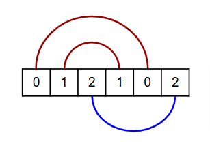

# Problem 1002: Connections II

Given an array of $2n$ elements where every value has exactly two occurrences, we say that it is *bipartite-connectable* if we can write the array on paper in a row and connect each pair of values either above or below without intersections.

For example, the array $\[0,1,2,1,0,2\]$ is bipartite-connectable:

Note that each connection must be strictly above or strictly below the array.

[Attached](assets/1002_input.txt) is an array given as a comma-separated list. The array has $160\\000$ elements consisting of $n=80\\000$ values, each one having two occurences.

The given array is bipartite-connectable. What is the maximal number of above connections that can be made while bipartite connecting this array?

---

[Source: projecteuler.net/problem=1002](https://projecteuler.net/problem=1002)
