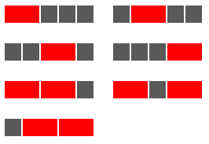

# Problem 116: Red, Green or Blue Tiles

A row of five grey square tiles is to have a number of its tiles replaced with coloured oblong tiles chosen from red (length two), green (length three), or blue (length four).

If red tiles are chosen there are exactly seven ways this can be done.

If green tiles are chosen there are three ways.

And if blue tiles are chosen there are two ways.

Assuming that colours cannot be mixed there are $7 + 3 + 2 = 12$ ways of replacing the grey tiles in a row measuring five units in length.

How many different ways can the grey tiles in a row measuring fifty units in length be replaced if colours cannot be mixed and at least one coloured tile must be used?

NOTE: This is related to [Problem 117](https://projecteuler.net/problem=117).

---

[Source: projecteuler.net/problem=116](https://projecteuler.net/problem=116)
