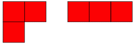
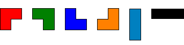
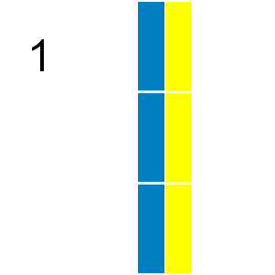

# Problem 161: Triominoes

A triomino is a shape consisting of three squares joined via the edges. There are two basic forms:

If all possible orientations are taken into account there are six:

Any $n$ by $m$ grid for which $n \times m$ is divisible by $3$ can be tiled with triominoes.  
If we consider tilings that can be obtained by reflection or rotation from another tiling as different there are $41$ ways a $2$ by $9$ grid can be tiled with triominoes:

In how many ways can a $9$ by $12$ grid be tiled in this way by triominoes?

---

[Source: projecteuler.net/problem=161](https://projecteuler.net/problem=161)
