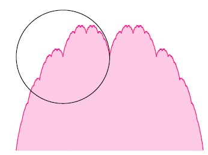

# Problem 226: A Scoop of Blancmange

The **blancmange curve** is the set of points $(x, y)$ such that $0 \le x \le 1$ and $y = \sum \limits\_{n = 0}^{\infty} {\dfrac{s(2^n x)}{2^n}}$, where $s(x)$ is the distance from $x$ to the nearest integer.

The area under the blancmange curve is equal to ½, shown in pink in the diagram below.

Let $C$ be the circle with centre $\left ( \frac{1}{4}, \frac{1}{2} \right )$ and radius $\frac{1}{4}$, shown in black in the diagram.

What area under the blancmange curve is enclosed by $C$?  
Give your answer rounded to eight decimal places in the form *0.abcdefgh*.

---

[Source: projecteuler.net/problem=226](https://projecteuler.net/problem=226)
