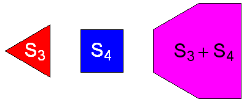

# Problem 228: Minkowski Sums

Let $S_n$ be the regular $n$-sided polygon – or shape – whose vertices $v_k$ ($k = 1, 2, \dots, n$) have coordinates:

$$\begin{align} x_k &= \cos((2k - 1)/n \times 180^\circ)\\ y_k &= \sin((2k - 1)/n \times 180^\circ) \end{align}$$

Each $S_n$ is to be interpreted as a filled shape consisting of all points on the perimeter and in the interior.

The **Minkowski sum**, $S + T$, of two shapes $S$ and $T$ is the result of adding every point in $S$ to every point in $T$, where point addition is performed coordinate-wise: $(u, v) + (x, y) = (u + x, v + y)$.

For example, the sum of $S_3$ and $S_4$ is the six-sided shape shown in pink below:

How many sides does $S\_{1864} + S\_{1865} + \cdots + S\_{1909}$ have?

---

[Source: projecteuler.net/problem=228](https://projecteuler.net/problem=228)
