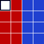
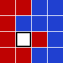

# Problem 244: Sliders

You probably know the game **Fifteen Puzzle**. Here, instead of numbered tiles, we have seven red tiles and eight blue tiles.

A move is denoted by the uppercase initial of the direction (Left, Right, Up, Down) in which the tile is slid, e.g. starting from configuration (**S**), by the sequence **LULUR** we reach the configuration (**E**):

|  |  |  |  |
|----|----|----|----|
| (**S**) |  | , (**E**) |  |

For each path, its checksum is calculated by (pseudocode):

$$\begin{align} \mathrm{checksum} &= 0\\ \mathrm{checksum} &= (\mathrm{checksum} \times 243 + m_1) \bmod 100\\000\\007\\ \mathrm{checksum} &= (\mathrm{checksum} \times 243 + m_2) \bmod 100\\000\\007\\ \cdots &\\ \mathrm{checksum} &= (\mathrm{checksum} \times 243 + m_n) \bmod 100\\000\\007 \end{align}$$ where $m_k$ is the ASCII value of the $k$`th` letter in the move sequence and the ASCII values for the moves are:

|       |     |
|-------|-----|
| **L** | 76  |
| **R** | 82  |
| **U** | 85  |
| **D** | 68  |

For the sequence **LULUR** given above, the checksum would be $19761398$.

Now, starting from configuration (**S**), find all shortest ways to reach configuration (**T**).

|  |  |  |  |
|----|----|----|----|
| (**S**) |  | , (**T**) |  |

What is the sum of all checksums for the paths having the minimal length?

---

[Source: projecteuler.net/problem=244](https://projecteuler.net/problem=244)
