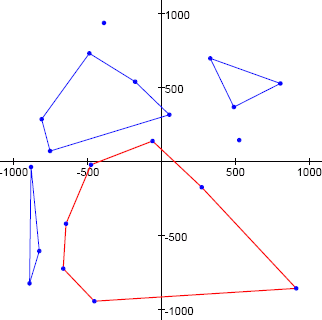

# Problem 252: Convex Holes

Given a set of points on a plane, we define a convex hole to be a convex polygon having as vertices any of the given points and not containing any of the given points in its interior (in addition to the vertices, other given points may lie on the perimeter of the polygon).

As an example, the image below shows a set of twenty points and a few such convex holes. The convex hole shown as a red heptagon has an area equal to $1049694.5$ square units, which is the highest possible area for a convex hole on the given set of points.

For our example, we used the first $20$ points $(T\_{2k - 1}, T\_{2k})$, for $k = 1,2,\dots,20$, produced with the pseudo-random number generator:

$$\begin{align} S_0 &= 290797\\ S\_{n + 1} &= S_n^2 \bmod 50515093\\ T_n &= (S_n \bmod 2000) - 1000 \end{align}$$

*i.e.* $(527, 144), (-488, 732), (-454, -947), \dots$

What is the maximum area for a convex hole on the set containing the first $500$ points in the pseudo-random sequence?  
Specify your answer including one digit after the decimal point.

---

[Source: projecteuler.net/problem=252](https://projecteuler.net/problem=252)
