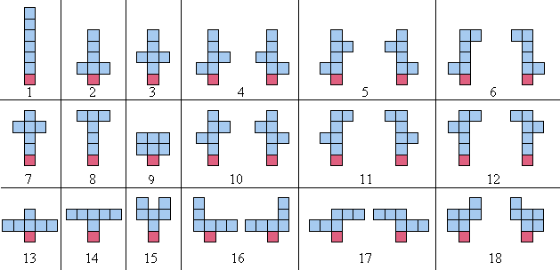

# Problem 275: Balanced Sculptures

Let us define a balanced sculpture of order $n$ as follows:

- A **polyominoAn arrangement of identical squares connected through shared edges; holes are allowed.** made up of $n + 1$ tiles known as the blocks ($n$ tiles)  
  and the plinth (remaining tile);
- the plinth has its centre at position ($x = 0, y = 0$);
- the blocks have $y$-coordinates greater than zero (so the plinth is the unique lowest tile);
- the centre of mass of all the blocks, combined, has $x$-coordinate equal to zero.

When counting the sculptures, any arrangements which are simply reflections about the $y$-axis, are <u>not</u> counted as distinct. For example, the $18$ balanced sculptures of order $6$ are shown below; note that each pair of mirror images (about the $y$-axis) is counted as one sculpture:

There are $964$ balanced sculptures of order $10$ and $360505$ of order $15$.  
How many balanced sculptures are there of order $18$?

---

[Source: projecteuler.net/problem=275](https://projecteuler.net/problem=275)
