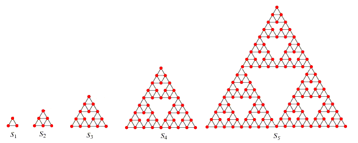
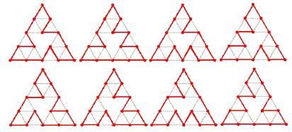

# Problem 312: Cyclic Paths on Sierpiński Graphs

\- A **Sierpiński graph** of order-$1$ ($S_1$) is an equilateral triangle.  
- $S\_{n + 1}$ is obtained from $S_n$ by positioning three copies of $S_n$ so that every pair of copies has one common corner.

Let $C(n)$ be the number of cycles that pass exactly once through all the vertices of $S_n$.  
For example, $C(3) = 8$ because eight such cycles can be drawn on $S_3$, as shown below:

It can also be verified that :  
$C(1) = C(2) = 1$  
$C(5) = 71328803586048$  
$C(10\\000) \bmod 10^8 = 37652224$  
$C(10\\000) \bmod 13^8 = 617720485$  

Find $C(C(C(10\\000))) \bmod 13^8$.

---

[Source: projecteuler.net/problem=312](https://projecteuler.net/problem=312)
