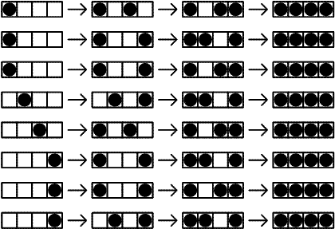

# Problem 364: Comfortable Distance

There are $N$ seats in a row. $N$ people come after each other to fill the seats according to the following rules:

1.  If there is any seat whose adjacent seat(s) are not occupied take such a seat.
2.  If there is no such seat and there is any seat for which only one adjacent seat is occupied take such a seat.
3.  Otherwise take one of the remaining available seats.

Let $T(N)$ be the number of possibilities that $N$ seats are occupied by $N$ people with the given rules.  
The following figure shows $T(4)=8$.

We can verify that $T(10) = 61632$ and $T(1\\000) \bmod 100\\000\\007 = 47255094$.

Find $T(1\\000\\000) \bmod 100\\000\\007$.

---

[Source: projecteuler.net/problem=364](https://projecteuler.net/problem=364)
