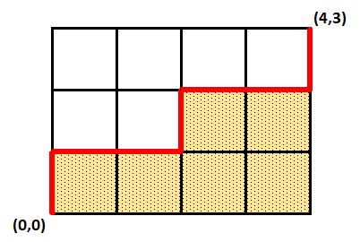

# Problem 638: Weighted Lattice Paths

Let $P\_{a,b}$ denote a path in a $a\times b$ lattice grid with following properties:

- The path begins at $(0,0)$ and ends at $(a,b)$.
- The path consists only of unit moves upwards or to the right; that is the coordinates are increasing with every move.

Denote $A(P\_{a,b})$ to be the area under the path. For the example of a $P\_{4,3}$ path given below, the area equals $6$.

Define $G(P\_{a,b},k)=k^{A(P\_{a,b})}$. Let $C(a,b,k)$ equal the sum of $G(P\_{a,b},k)$ over all valid paths in a $a\times b$ lattice grid.

You are given that

- $C(2,2,1)=6$
- $C(2,2,2)=35$
- $C(10,10,1)=184\\756$
- $C(15,10,3) \equiv 880\\419\\838 \mod 1\\000\\000\\007$
- $C(10\\000,10\\000,4) \equiv 395\\913\\804 \mod 1\\000\\000\\007$

Calculate $\displaystyle\sum\_{k=1}^7 C(10^k+k, 10^k+k,k)$. Give your answer modulo $1\\000\\000\\007$

---

[Source: projecteuler.net/problem=638](https://projecteuler.net/problem=638)
