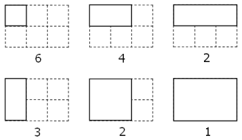

# Problem 85: Counting Rectangles

By counting carefully it can be seen that a rectangular grid measuring $3$ by $2$ contains eighteen rectangles:

Although there exists no rectangular grid that contains exactly two million rectangles, find the area of the grid with the nearest solution.

---

[Source: projecteuler.net/problem=85](https://projecteuler.net/problem=85)
