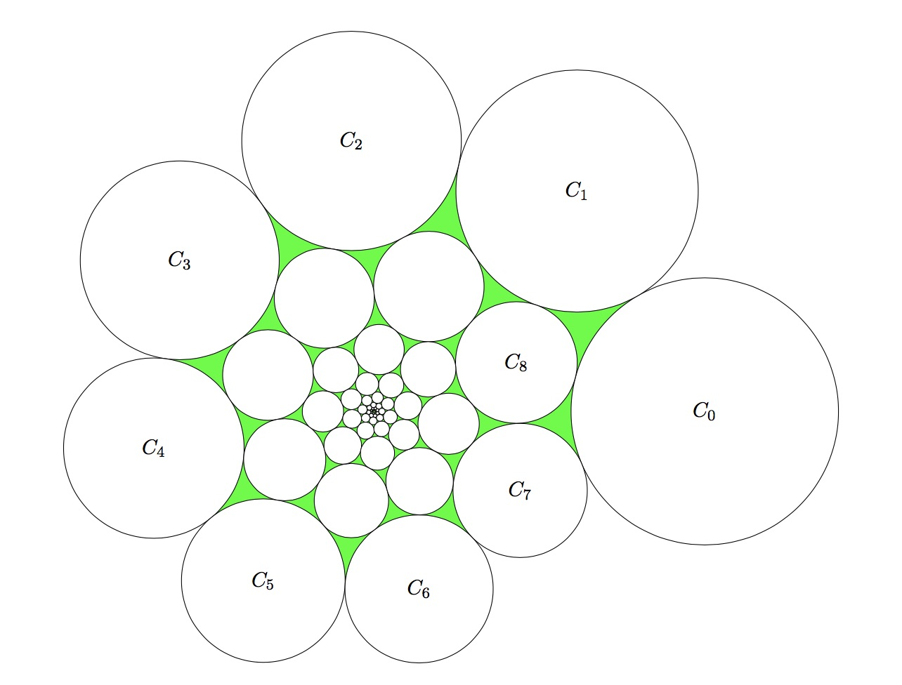

# Problem 894: Spiral of Circles

Consider a **unit circlecircle with radius 1** $C_0$ on the plane that does not enclose the origin. For $k\ge 1$, a circle $C_k$ is created by scaling and rotating $C\_{k - 1}$ **with respect to the origin**. That is, both the radius and the distance to the origin are scaled by the same factor, and the centre of rotation is the origin. The scaling factor is positive and strictly less than one. Both it and the rotation angle remain constant for each $k$.

It is given that $C_0$ is externally tangent to $C_1$, $C_7$ and $C_8$, as shown in the diagram below, and no two circles overlap.

Find the total area of all the **circular trianglesA circular triangle is a triangle with circular arc edges** in the diagram, i.e. the area painted green above.  
Give your answer rounded to $10$ places after the decimal point.

---

[Source: projecteuler.net/problem=894](https://projecteuler.net/problem=894)
