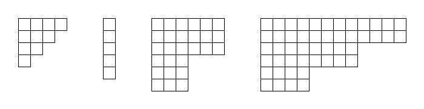

# Problem 922: Young's Game A

A **Young diagram** is a finite collection of (equally-sized) squares in a grid-like arrangement of rows and columns, such that

- the left-most squares of all rows are aligned vertically;
- the top squares of all columns are aligned horizontally;
- the rows are non-increasing in size as we move top to bottom;
- the columns are non-increasing in size as we move left to right.

Two examples of Young diagrams are shown below.

Two players Right and Down play a game on several Young diagrams, all disconnected from each other. Initially, a token is placed in the top-left square of each diagram. Then they take alternating turns, starting with Right. On Right's turn, Right selects a token on one diagram and moves it **any number of squares** to the right. On Down's turn, Down selects a token on one diagram and moves it **any number of squares** downwards. A player unable to make a legal move on their turn loses the game.

For $a,b,k\geq 1$ we define an $(a,b,k)$-staircase to be the Young diagram where the bottom-right frontier consists of $k$ steps of vertical height $a$ and horizontal length $b$. Shown below are four examples of staircases with $(a,b,k)$ respectively $(1,1,4),$ $(5,1,1),$ $(3,3,2),$ $(2,4,3)$.

Additionally, define the weight of an $(a,b,k)$-staircase to be $a+b+k$.

Let $R(m, w)$ be the number ways of choosing $m$ staircases, each having weight not exceeding $w$, upon which Right (moving first in the game) will win the game assuming optimal play. Different orderings of the same set of staircases are to be counted separately.

For example, $R(2, 4)=7$ is illustrated below, with tokens as grey circles drawn in their initial positions.

You are also given $R(3, 9)=314104$.

Find $R(8, 64)$ giving your answer modulo $10^9+7$.

---

[Source: projecteuler.net/problem=922](https://projecteuler.net/problem=922)
